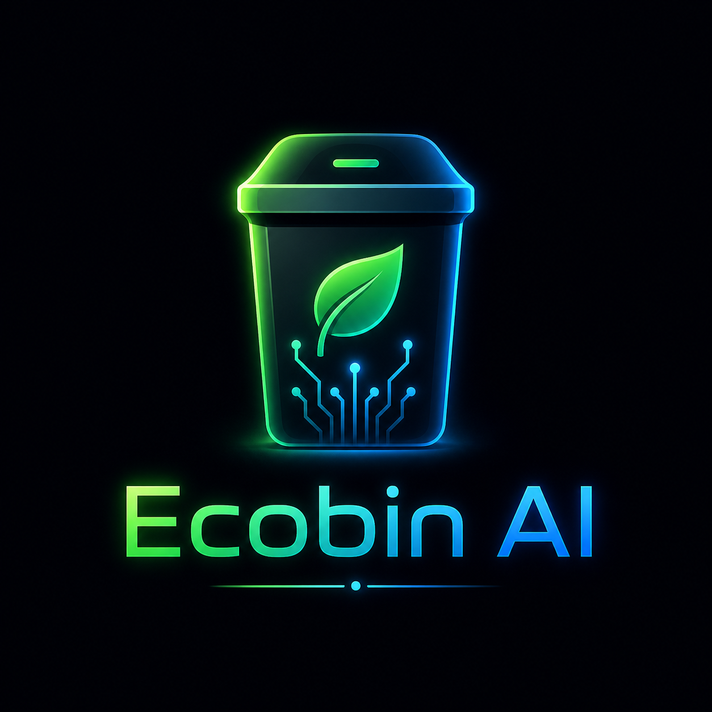

<div align="center">
  

  # EcoBin AI — Smart Waste Sorting with Gemma 4

  **One item. One bin. One correct decision at a time.**

  [Live demo →](https://ecobinai.fly.dev/)

  > *Gemma 4 Good Hackathon Submission — Theme: Global Resilience · Category: Environmental AI*
</div>

---

## The problem worth solving

The world generates more than **2 billion metric tons of waste every year**, and the number is rising fast. The real issue is not how much waste we create — it is how badly we manage it.

**Today, only 1 in 4 items placed in a recycling bin actually gets recycled.** The rest ends up in landfill because of contamination, confusion, or incorrect sorting. Labels are confusing. Materials overlap. Rules change from city to city. So people guess.

Somewhere right now, someone is standing in front of a bin, holding an item, wondering: *"Does this go here… or there?"* That single moment of uncertainty, repeated billions of times every day, is contributing to pollution across our soil, oceans, and air.

We celebrate AI for writing poems, generating art, and having conversations. If AI cannot help humanity solve something this basic and this universal, what exactly are we building toward?

**EcoBin AI is that bin.**

---

## How it works

A user holds an item in front of the camera. EcoBin AI streams the frame to **Gemma 4 — Google's advanced multimodal vision model** — which identifies the material, classifies it in real time, explains its reasoning, flags contamination, and triggers the correct bin lid to open automatically. No buttons. No app. No confusion.

> All of this happens in **under three seconds**, with the result card painting on screen *while* the model is still streaming tokens.

### Four bins, plus the edge cases nobody else handles

| Bin | Examples |
|---|---|
| ♻️ **Recyclable** | Clean plastic, glass, aluminum, cardboard, paper |
| 🌱 **Compost** | Food scraps, organic matter, soiled paper |
| 🗑️ **Trash** | Contaminated recyclables, styrofoam, disposable cups, non-recyclables |
| ⚠️ **Hazardous** | Batteries, electronics, chemicals, medications |
| ❓ **Pending** | Opaque containers — the system asks the user a yes/no question by voice before deciding |
| 👤 **Human** | Only when no waste item is visible at all — the bin gently reminds you it sorts waste, not people |

**The contamination rule is non-negotiable.** A recyclable container with visible food residue is classified as **TRASH**, not RECYCLABLE — because in the real world a single contaminated item ruins an entire batch of recyclables. Disposable coffee cups are always TRASH regardless of branding, angle, or apparent cleanliness. These rules are embedded in the system prompt as inviolable constraints, not left to model judgment.

---

## Why Gemma 4 makes this work

A traditional image classifier trained on a waste dataset achieves high accuracy on known categories and fails completely on everything else. **Gemma 4's multimodal reasoning handles the edge cases that no CNN ever could:** a Starbucks cup held at an angle, a container that might be empty or might not, a hand holding something ambiguous, awkward lighting and camera angles. It classifies, explains, and flags contamination in a single inference call.

The system supports **three Gemma 4 backends**, configured via environment variable:

| Backend | When to use it | How |
|---|---|---|
| **`google_ai_studio`** *(default)* | Live cloud demo, fast iteration | `gemma-4-26b-a4b-it` via the `google-genai` SDK. Image bytes sent as raw JPEG to avoid serialization errors. Temperature fixed at `0.0` for deterministic output. Fallback chain: **`gemma-4-26b-a4b-it` → `gemma-4-31b-it` → `gemini-2.5-flash`** ensures uninterrupted classification during model outages. |
| **`ollama`** | Fully offline / edge / air-gapped deployments | Gemma 4 served locally via a persistent `httpx` connection pool. Zero internet, zero ongoing cost. |
| **`huggingface`** | Domain-specific fine-tuned weights | `AutoModelForImageTextToText` in `bfloat16` with `device_map="auto"`, supporting Unsloth LoRA fine-tuned weights. |

---

## Architecture

```
┌─────────────────────────────────────────────────────────────────┐
│                         EcoBin AI System                        │
│                                                                 │
│  📷 Live camera   ──►   🧠 Gemma 4 Vision   ──►   🔧 Actuation │
│  or 📁 upload          (multimodal, SSE)        open_bin_lid() │
│                              │                                  │
│              JSON extraction (4-stage fallback)                 │
│              Confidence gate (< 0.75 → TRASH)                   │
│              Hard-coded disposal rules                          │
│                              │                                  │
│                  📊 Live React dashboard                        │
│                     · Streaming reasoning panel                 │
│                     · Real-time bin lid animation               │
│                     · Pie chart + impact counters               │
│                     · WebSocket lid-state sync                  │
│                              │                                  │
│                    🗄️  SQLite event log                         │
└─────────────────────────────────────────────────────────────────┘
```

### Engineering decisions that set this apart

- **Streaming SSE classification** (`POST /api/classify/image/stream`) emits three progressive event types: `analyzing` on receipt, **`partial`** the moment the `category` field is parsed from the live token stream, and `complete` when the full result is ready. The colored result card renders *while* Gemma 4 is still generating — making the system feel instantaneous even at 2–4 s model latency.
- **Four-stage JSON extraction.** Gemma 4 does not always emit clean JSON. The pipeline handles markdown fences, reasoning preambles, partial outputs, and nested blocks in order, falling back at each stage. Classification never silently fails.
- **MD5-keyed LRU cache (50 items).** Identical frames are never re-classified — meaningful in high-throughput environments.
- **Image optimization.** Frames are resized to 512 px max and re-encoded as JPEG quality 85 before inference. Faster uploads, fewer vision tokens, lower cost.
- **Scene-change auto-scan.** In live-camera auto mode, frames are downsampled to a 32×32 grayscale thumbnail and compared frame-to-frame. A new classification fires *only* when the scene has changed meaningfully — so a static waste item or a person standing still is classified once, not on a loop.
- **Voice-gated capture loop.** The auto-scan refuses to fire while the previous classification's voiceover is still speaking, so announcements always play in full.
- **Persistent lids.** Bin lids stay open for a full **60 s** after a classification, closing only when the next item is scanned — giving users time to actually use the result.
- **Confidence gate.** Below `0.75`, the system defaults to **TRASH**. In a contamination context, a cautious misclassification is always preferable to a confident wrong one.
- **Clean hardware abstraction.** The same controller interface drives both real GPIO servo motors and the software simulator. The demo and the field deployment behave identically.

---

## The dashboard

| Feature | Details |
|---|---|
| **Live camera mode** | Defaults to the rear camera on phones, with an iOS-style flip-camera button. Mirror-corrected for selfie use. |
| **Auto-scan toggle** | Only re-analyzes when the scene meaningfully changes; never interrupts voice. |
| **Upload mode** | Drag-and-drop or file picker for testing arbitrary images. |
| **Streaming reasoning panel** | Shows Gemma 4's chain-of-thought token-by-token as it decides. |
| **Realistic bin SVGs** | Four animated wheelie bins with hinged lids, wheels, and a pulsing "▼ DROP IT IN" badge over the open bin. |
| **Voice output** | Web Speech API announcement of category + reasoning + education tip; multilingual voice fallback. |
| **Voice input** | For PENDING items, the system asks a clarifying yes/no question and listens for the answer. |
| **Live stats** | Total items · contamination rate · per-category tile (count + %) · pie chart with icon callouts (count + %) · live impact counter (items sorted, CO₂ diverted, recyclables saved). |
| **Recent activity feed** | Last 10 classifications with timestamps and contamination flags. |
| **Mobile-responsive** | Bin sizing, gaps, and typography scale automatically on iPhone/Android. |

---

## Wording rules baked into the prompt

The model is explicitly instructed to:

- Refer to bins by name: *"recycling bin", "compost bin", "trash bin", "hazardous waste bin"*.
- Use **"place in"**, **"put in"**, or **"goes in"** — **never** "throw away", "throw it out", "toss", "discard", or any synonym of throwing.
- Choose `HUMAN` only when **no** waste item is visible anywhere in the frame. Hands or a person are background context, not a reason to skip classifying the item.

---

## Tech stack

| Layer | Technology |
|---|---|
| AI model | **Gemma 4** via `google-genai` SDK (cloud) or Ollama (edge) |
| Fine-tuning | **Unsloth + LoRA** on TACO / TrashNet (optional) |
| Backend | **FastAPI**, SSE streaming, **SQLAlchemy** + SQLite, WebSocket for lid state |
| Vision | **Pillow** for resize/encoding; persistent `httpx` client for Ollama |
| Hardware (Pi) | **RPi.GPIO** + servo motors (real) / software simulator (dev/cloud) |
| Frontend | **React 18** + **Vite** + **Tailwind CSS** + **Recharts** + Web Speech API |
| Cloud deploy | **Fly.io** (multi-stage Docker, persistent SQLite volume, 1 GB Sydney/Amsterdam machine) |
| Edge runtime | **Ollama** on Raspberry Pi 5 with Gemma 4 |

---

## Built for global resilience

The communities where waste mismanagement is most severe are also the communities with the least reliable internet. EcoBin AI was designed for them:

- The **Ollama backend** operates with zero connectivity.
- The full system runs on a **Raspberry Pi 5** at a total hardware cost of **~$80**, less than a single month of most SaaS subscriptions.
- The codebase is **open source and self-contained**. No vendor lock-in, no ongoing cloud cost, no dependency on infrastructure that does not exist in the places that need this most.

This is not AI built for a conference demo. It is AI built to be deployed in a school cafeteria in rural Kenya, a community recycling point in coastal Indonesia, or a university bin in Edinburgh — and work the same way in all three.

---

## Quick start — simulation mode (any Mac / PC / Linux)

```bash
git clone <repo-url>
cd EcoBinAI

# 1. Backend
python -m venv .venv
source .venv/bin/activate          # Windows: .venv\Scripts\activate
pip install -r requirements.txt

# 2. Frontend
cd frontend && npm ci && npm run build && cd ..

# 3. Configure
cp .env.example .env
# Edit .env: set GOOGLE_AI_API_KEY (free at https://aistudio.google.com/app/apikey)

# 4. Run
uvicorn backend.api.main:app --host 0.0.0.0 --port 8000
# Open http://localhost:8000
```

Upload a photo of any waste item or use the live camera. Gemma 4 will classify it, stream the reasoning, and the correct bin lid animates open.

---

## Edge / offline mode — Raspberry Pi 5 + Ollama

```bash
# On the Raspberry Pi 5
curl -fsSL https://ollama.com/install.sh | sh
ollama pull gemma4:e2b              # or gemma4:e4b for better accuracy

# System deps
sudo apt-get update
sudo apt-get install -y python3 python3-venv python3-dev python3-opencv \
  libjpeg-dev libopenjp2-7-dev libatlas-base-dev pkg-config

# Project setup
./scripts/setup_pi.sh
```

`.env` for edge hardware:
```env
GEMMA_BACKEND=ollama
OLLAMA_MODEL=gemma4:e2b
HARDWARE_MODE=true
CAMERA_INDEX=/dev/video0
```

```bash
source .venv/bin/activate
uvicorn backend.api.main:app --host 0.0.0.0 --port 8000
```

No internet required after the model is downloaded.

---

## Cloud deploy — Fly.io

The repo ships with a working `fly.toml` and a **multi-stage Dockerfile** that builds the React frontend and the Python backend in one go.

```bash
fly auth login
fly apps create ecobinai
fly volumes create ecobin_data --region ams --size 1
fly secrets set GOOGLE_AI_API_KEY=your_key_here -a ecobinai
fly deploy -a ecobinai
```

The live instance at <https://ecobinai.fly.dev/> runs on a 1 GB shared-cpu machine with a persistent volume for the SQLite event log.

---

## Fine-tuning Gemma 4 on waste data

Run on a free Kaggle T4 GPU notebook (~90 min):

```bash
python -m model.dataset_prep --source trashnet \
    --input data/dataset-resized --output data/train.jsonl

python -m model.fine_tune \
    --model google/gemma-4-e2b-it \
    --data  data/train.jsonl \
    --output ./fine_tuned_ecobin \
    --push_to_hub your-username/ecobin-gemma4-e2b

python -m model.evaluate --data data/test.jsonl
```

---

## API reference

| Method | Endpoint | Description |
|---|---|---|
| `POST` | `/api/classify/image` | Classify a waste item image (non-streaming) |
| `POST` | `/api/classify/image/stream` | **Streaming** SSE — `analyzing` → `partial` → `complete` |
| `GET` | `/api/classify/lid-states` | Current bin lid states |
| `WS` | `/api/classify/ws/lid-states` | Real-time lid state stream |
| `GET` | `/api/stats/` | Aggregated waste statistics |
| `GET` | `/api/stats/recent?limit=10` | Recent classification events |
| `GET` | `/api/stats/impact` | Environmental impact counter (CO₂ diverted, recyclables saved) |
| `GET` | `/api/health` | System health check |

Full interactive docs at `/docs` (Swagger UI).

---

## Tests

```bash
source .venv/bin/activate
pytest tests/ -v
```

Tests cover: classifier logic, contamination detection, JSON-extraction fallbacks, API endpoints, hardware simulator, WebSocket events.

---

## Project structure

```
EcoBinAI/
├── backend/
│   ├── api/            # FastAPI routes, SSE streaming, WebSocket, schemas
│   ├── classifier/     # Gemma 4 client (3 backends), waste classifier, prompts
│   ├── hardware/       # Bin controller, camera, simulator, broadcaster
│   └── database/       # SQLAlchemy models, event log
├── frontend/
│   ├── public/         # logo.png, favicon
│   └── src/
│       ├── components/ # CameraFeed, BinDisplay, ClassificationResult, StatsPanel
│       ├── hooks/      # useSpeech, useSpeechRecognition
│       └── App.tsx     # Dashboard root
├── model/              # Unsloth LoRA fine-tuning + evaluation scripts
├── tests/              # pytest suite
├── docker/             # docker-compose
├── scripts/            # setup_pi.sh, run_demo.sh
├── Dockerfile          # Multi-stage: Node build → Python runtime
└── fly.toml            # Fly.io deployment config
```

---

## The closing argument

Waste management is not just an environmental issue — it is a human issue. And if we continue ignoring it, future generations will inherit a world overwhelmed by pollution and buried in waste.

We already know what needs to be done.

**EcoBin AI. One item. One bin. One correct decision at a time.**

---

*Built for the Gemma 4 Good Hackathon · Powered by Google Gemma 4*
